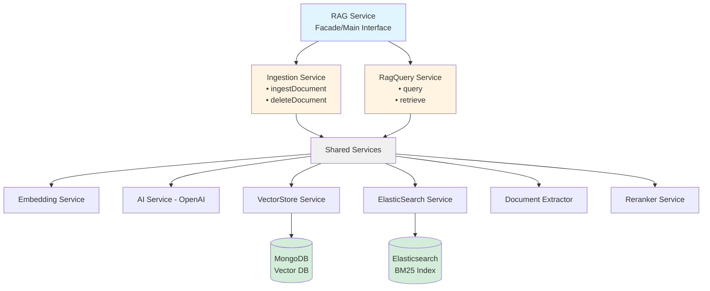
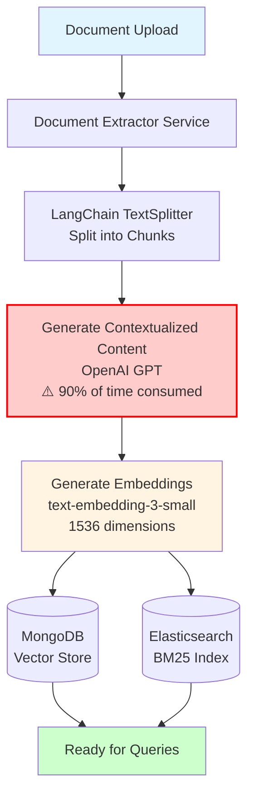
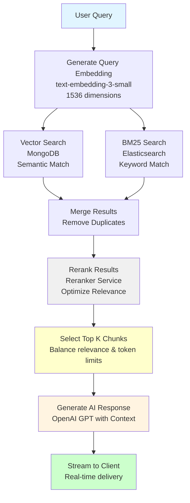

# RAG Module Documentation

## Overview

The RAG (Retrieval-Augmented Generation) module provides a comprehensive system for document ingestion, semantic search, and intelligent query answering. It combines vector-based similarity search with traditional BM25 search to deliver highly relevant context for AI-powered responses.

## Architecture

### High-Level System Architecture



### Core Components

The RAG module consists of three main service layers:

1. **RagService** - Facade class that provides a unified interface for RAG operations
2. **IngestionService** - Handles document processing, chunking, and storage
3. **RagQueryService** - Manages query processing, context retrieval, and response generation

### Technology Stack

| Component       | Technology                    | Purpose                                        |
| --------------- | ----------------------------- | ---------------------------------------------- |
| Vector Store    | MongoDB                       | Stores document embeddings for semantic search |
| BM25            | Elasticsearch                 | Provides BM25-based keyword search             |
| Embedding Model | OpenAI text-embedding-3-small | Generates 1536-dimensional embeddings          |
| LLM             | OpenAI GPT                    | Contextualizes chunks and generates responses  |
| Text Processing | LangChain TextSplitter        | Splits documents into manageable chunks        |
| Reranking       | Cohere Reranker               | Optimizes search result relevance              |

### Folder Structure

```
routes/rag/core/
├── embeddings.ts          # Embedding generation service
├── reranker.ts           # Result reranking logic
├── index.ts              # Main RAG service facade
├── vectorStore.ts        # MongoDB vector store operations
├── ingestion.ts          # Document ingestion pipeline
├── ragQuery.ts           # Query processing and retrieval
├── documentExtractor.ts  # Document text extraction
├── aiService.ts          # OpenAI integration
└── elasticSearch.ts      # Elasticsearch operations
```

## Document Ingestion Flow

### Process Overview

The document ingestion pipeline transforms raw documents into searchable, semantically-indexed content.



### Pipeline Steps

#### 1. Document Upload

- Accepts various document formats
- Validates file type and size
- Prepares document for processing

#### 2. Text Extraction

- Uses `documentExtractor.ts` to extract raw text
- Handles multiple document formats
- Preserves document structure where possible

#### 3. Text Chunking

- Utilizes LangChain TextSplitter
- Splits text into semantically coherent chunks
- Maintains overlap between chunks for context preservation

#### 4. Contextualization ⚠️

- **Performance Bottleneck**: Consumes ~90% of ingestion time
- Generates enhanced context for each chunk using OpenAI
- Adds metadata and relevance information
- Improves retrieval accuracy

#### 5. Embedding Generation

- Uses OpenAI's `text-embedding-3-small` model
- Generates 1536-dimensional vectors
- Creates semantic representations of chunks

#### 6. Storage

- **MongoDB**: Stores embeddings for vector similarity search
- **Elasticsearch**: Indexes content for BM25 keyword search
- Maintains bidirectional references

### IngestionService API

#### `ingestDocument({document, userId, chatId, fileScope}: IIngestDocumentParams)`

Processes and stores a document in the RAG system.

**Parameters:**

```typescript
export interface IRagDocument {
  id: string;
  content: string;
  metadata?: Record<string, any>;
}

export interface IIngestDocumentParams {
  document: IRagDocument;
  userId: string;
  chatId?: string;
  fileScope: RAG_FILE_SCOPE;
}
```

**Returns:** Ingestion status and document metadata

**Process:**

1. Extracts text from document
2. Splits text into chunks
3. Contextualizes each chunk
4. Generates embeddings
5. Stores in vector store and search index

#### `deleteDocument(documentId)`

Removes a document and all its chunks from the system.

**Parameters:**

- `documentId`: Unique identifier of the document to delete

**Returns:** Deletion confirmation

**Process:**

1. Retrieves all chunks associated with document
2. Removes entries from MongoDB
3. Removes entries from Elasticsearch
4. Cleans up metadata

## Query Processing Flow

### Process Overview

The query pipeline retrieves relevant context and generates intelligent responses using a hybrid search approach.



### Pipeline Steps

#### 1. Query Embedding

- Converts user query to embedding vector
- Uses same embedding model as document ingestion
- Ensures semantic consistency

#### 2. Dual Retrieval Strategy

**Vector Search (MongoDB)**

- Performs cosine similarity search
- Finds semantically similar chunks
- Excellent for conceptual matches

**BM25 Search (Elasticsearch)**

- Performs keyword-based search
- Finds exact term matches
- Excellent for specific terminology

#### 3. Result Merging

- Combines results from both search methods
- Removes duplicates
- Maintains relevance scores

#### 4. Reranking

- Uses reranker service to optimize result order
- Considers query intent and context
- Improves overall relevance

#### 5. Context Selection

- Selects top N most relevant chunks
- Balances relevance with token limits
- Prepares context for LLM

#### 6. Response Generation

- Sends context and query to OpenAI
- Generates coherent, accurate response
- Cites sources where applicable

#### 7. Streaming

- Streams response to client in real-time
- Provides better user experience

### RagQueryService API

#### `query(userQuery, options)`

Processes a query and returns an AI-generated response.

**Parameters:**

- `userQuery`: The user's question or search query
- `options`: Configuration for retrieval and generation

### Retrieval Options

You can toggle different retrieval strategies:

```typescript
{
  useEmbeddings: boolean,      // Use vector similarity search
  useBM25: boolean,            // Use keyword-based search
  useReranking: boolean,       // Use LLM-based reranking
  topK: number,                // Number of final results
  initialRetrievalCount: number // Number of candidates before reranking
}
```

**Returns:** Generated response (string or stream)

**Process:**

1. Generates query embedding
2. Retrieves context from vector store
3. Retrieves context from Elasticsearch
4. Merges and reranks results
5. Generates response using LLM
6. Streams response to client

#### `retrieve(userQuery, options)`

Retrieves relevant document chunks without generating a response.

**Parameters:**

- `userQuery`: The search query
- `options`: Retrieval configuration

**Returns:** Array of relevant document chunks with scores

**Process:**

1. Generates query embedding
2. Performs vector search
3. Performs BM25 search
4. Merges and reranks results
5. Returns top K results

### Bottlenecks

1. **Contextualization (90% of ingestion time)**
   - Each chunk requires an LLM call
   - Sequential processing increases latency
   - **Optimization strategies:**
     - Batch processing where possible
     - Async/parallel processing
     - Caching for similar chunks

### Service Configuration

Refer to individual service files for specific configuration options:

- `embeddings.ts` - Embedding model and dimension settings
- `vectorStore.ts` - MongoDB connection and indexing options
- `elasticSearch.ts` - Elasticsearch index configuration
- `ingestion.ts` - Chunking and processing parameters
- `ragQuery.ts` - Retrieval and generation settings

## Performance Comparison

- **Embeddings only**: Good semantic understanding
- **BM25 only**: Fast, good for exact matches
- **Hybrid (Embeddings + BM25)**: 49% better retrieval (recommended)
- **Hybrid + Reranking**: 67% better retrieval (best quality)

### Chunking Configuration

Adjust in `/utils/constants/rag.ts`:

```typescript
export const CHUNKING_OPTIONS = {
  chunkSize: 1000,
  chunkOverlap: 200,
};
```

## 🔄 Switching Providers

The system is designed with interfaces, making it easy to swap providers:

### Switching Embedding Models

```typescript
// Option 1: OpenAI (current)
import { OpenAIEmbeddingService } from "@/services/rag/embeddings";
const embeddingService = new OpenAIEmbeddingService();

// Option 2: Voyage AI
import { VoyageEmbeddingService } from "@/services/rag/embeddings";
const embeddingService = new VoyageEmbeddingService();
```

### Switching Rerankers

```typescript
// Option 1: OpenAI (current)
import { OpenAIReranker } from "@/services/rag/reranker";
const reranker = new OpenAIReranker();

// Option 2: Cohere
import { CohereReranker } from "@/services/rag/reranker";
const reranker = new CohereReranker();

// Option 3: Simple scoring
import { ScoringReranker } from "@/services/rag/reranker";
const reranker = new ScoringReranker();
```

## 📊 Supported File Types

The DocumentExtractorService supports:

- ✅ **Text**: `.txt`, `.md`, `.html`
- ✅ **PDF**: `.pdf`
- ✅ **Word**: `.docx`, `.doc`
- ✅ **Excel**: `.xlsx`, `.xls`
- ✅ **CSV**: `.csv`
- ✅ **JSON**: `.json`
